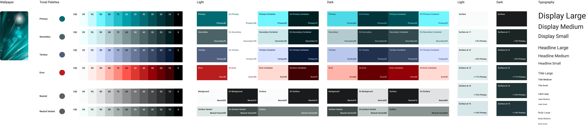

## Material You using Jetpack Compose

### [Android Code Search (https://cs.android.com/) - Material 3 Samples](https://cs.android.com/androidx/platform/frameworks/support/+/androidx-main:compose/material3/material3/samples/src/main/java/androidx/compose/material3/samples/)
These samples are related with the Compose Material 3 Google Play Store App - https://play.google.com/store/apps/details?id=androidx.compose.material.catalog

### [Implementing Material You using Jetpack Compose](https://youtu.be/jrfuHyMlehc)

### [Material You & Figma: Bringing Dynamic Color & brand together - Rody Davis, Ivy Knight (Schema 2021)](https://youtu.be/clDuqcKgNBQ)

### [Tools](https://m3.material.io/)

### [Jetchat sample](https://github.com/android/compose-samples/tree/main/Jetchat)

### [Material 3 Samples - source code on AOSP](https://cs.android.com/androidx/platform/frameworks/support/+/androidx-main:compose/material3/material3/samples/src/main/java/androidx/compose/material3/samples/?q=compose%2Fmaterial3%2Fmaterial3%2Fsamples%2Fsrc%2Fmain%2Fjava%2Fandroidx%2Fcompose%2Fmaterial3%2Fsamples%2F&ss=androidx%2Fplatform%2Fframeworks%2Fsupport)

### [Material 3 Compose components](https://developer.android.com/reference/kotlin/androidx/compose/material3/package-summary)

### [Code With the Italian - Repo - Bundel](https://github.com/code-with-the-italians/bundel)  
In this repo we can see how to keep M2 alongside with M3 in a project.

### [Gist - Using both Material 3 and material components in Compose within the same theme](https://gist.github.com/hvisser/8db0669439bad5b8d7491d4ef3f6d3de)  
If you want to move to Material 3 w/ Jetpack Compose but also still need components from the material package, then you can wrap the two MaterialTheme instances in your theme.
This gist maps most of the colors and typography from new to old

